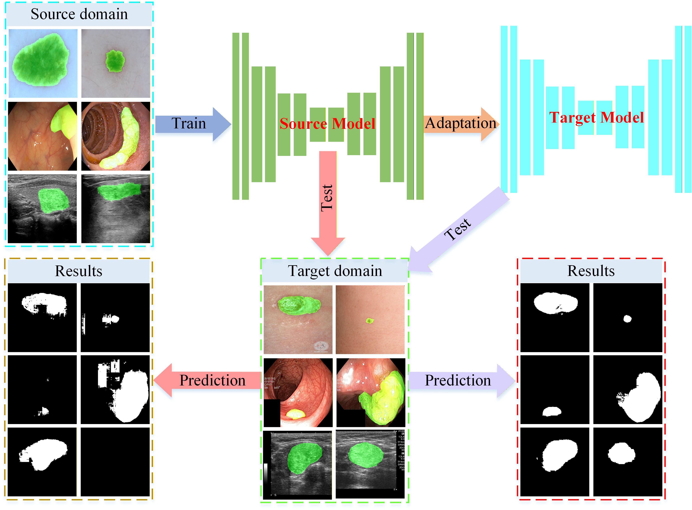
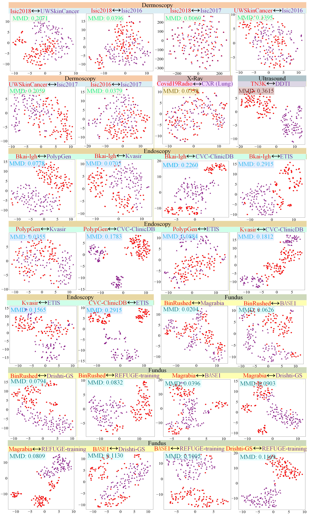
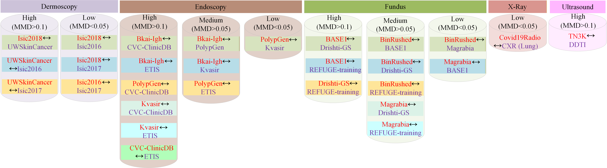
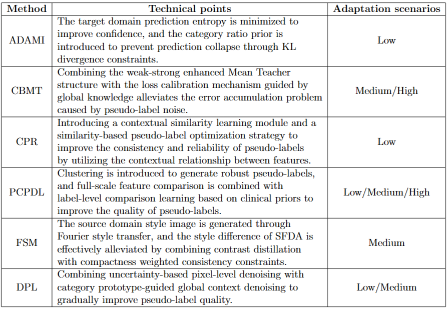

# :page_facing_up: MedShift-SFDA: A Difficulty-graded Benchmark for Source-Free Domain Adaptation in Medical Image Segmentation

### The image below shows a comparison of the segmentation before and after SFDA approval.

<p align="center"></p>

### The image below shows a visualization of inter-dataset domain shift.  

<p align="center"></p>

### The figure below illustrates the domain shift classification between different modal datasets.

<p align="center"></p>


### The table illustrates the key technical aspects and adaptations of different methods.

<p align="center"></p>

### Discussion
Methodological insights
1. Low domain shift
In scenarios with minimal inter-domain variation (e.g., Isic2016 ——> Isic2018, Covid19Radio ——> CXR), all evaluated methods demonstrate competitive performance with Dice scores generally above 85\%. Notably, DPL, PCPDL, and ADAMI exhibit high robustness in such settings, benefiting from mechanisms like uncertainty-aware pseudo-label denoising, dual-level contrastive learning, and class-ratio priors, respectively. These methods effectively exploit semantic similarities between source and target domains, enabling stable convergence and accurate segmentation. FSM, despite utilizing frequency-based style alignment, shows slightly degraded performance in low-shift scenarios, likely due to its overreliance on stylistic cues rather than feature-level refinement.
2. Medium domain shift
Under moderate domain shifts (e.g., Bkai-Igh ——> Kvasir, BinRushed ——> Drishti-GS), method performance begins to diverge. PCPDL consistently achieves Dice \textgreater80\%, demonstrating its advantage in handling structural variability through semantic-guided clustering and contrastive regularization. CBMT, DPL, and FSM also maintain reasonable performance (Dice $\sim 75\%$
), attributed to their hybrid designs incorporating teacher-student consistency, pseudo-label correction, and perceptual style adaptation. In contrast, CPR and ADAMI encounter performance drops on challenging tasks (e.g., OC segmentation), indicating sensitivity to pseudo-label noise and limited resilience to label imbalance or spatial ambiguity.
3. High domain shift
When facing substantial domain gaps (e.g., Bkai-Igh ——> ETIS, TN3K ——> DDTI), the performance of all methods degrades significantly, with Dice scores falling below 70\% in most cases. PCPDL and CBMT retain relatively better results in high-shift scenarios, owing to their ability to refine representations using cross-domain contrast and balance priors. Their adaptive mechanisms provide more reliable supervision under noisy conditions. DPL and CPR struggle with pseudo-label degradation, while FSM and ADAMI perform worst under severe shifts, likely due to insufficient handling of semantic misalignment and reliance on brittle assumptions (e.g., frequency or entropy minimization). These findings emphasize the need for methods that incorporate robust semantic priors, adaptive pseudo-label correction, and task-aware regularization when facing real-world inter-domain variability.
To further enhance the practicality of the benchmark, we summarize the methods from the two dimensions of “technical points" and “adaptive scenarios", As shown in Table 1 above.. This summary not only helps us understand the core contributions of each method from a technical perspective, but also provides guidance for the selection and deployment of subsequent methods.

Clinical implications
In clinical practice, understanding domain shift severity is essential for deploying trustworthy AI systems across heterogeneous environments. For instance, transferring a segmentation model trained on high-resolution hospital-grade ultrasound to portable devices used in resource-limited clinics constitutes a high-shift scenario, where image quality, anatomical visibility, and patient demographics may all differ. The difficulty-graded benchmark provided by MedShift-SFDA offers valuable guidance for:

1. Model selection based on clinical deployment context
For settings with low domain shift (e.g., same modality, equipment, and anatomy), lightweight methods like ADAMI or DPL are sufficient. In medium shift settings (e.g., cross-center, moderate anatomical variation), robust contrastive and correction-based strategies like PCPDL or CBMT are preferable. For high shift domains (e.g., complex pathology), more advanced models with semantic consistency mechanisms are required.
2. Risk estimation and adaptation planning
Clinicians and engineers can use domain shift metrics (e.g., MMD + t-SNE visualizations) to anticipate adaptation challenges, proactively select suitable methods, or even trigger model revalidation before clinical deployment.

In summary, our benchmark not only evaluates SFDA algorithmic performance but also bridges the gap between method development and real-world healthcare deployment, offering practical insights for building safe, reliable, and generalizable medical AI systems.


### Clinical significance of this benchmark:
In clinical practice, understanding domain shift severity is essential for deploying trustworthy AI systems across heterogeneous environments. For instance, transferring a segmentation model trained on high-resolution hospital-grade ultrasound to portable devices used in resource-limited clinics constitutes a high-shift scenario, where image quality, anatomical visibility, and patient demographics may all differ. The difficulty-graded benchmark provided by MedShift-SFDA offers valuable guidance for:
1. Model selection based on clinical deployment context
For settings with low domain shift (e.g., same modality, equipment, and anatomy), lightweight methods like ADAMI or DPL are sufficient. In medium shift settings (e.g., cross-center, moderate anatomical variation), robust contrastive and correction-based strategies like PCPDL or CBMT are preferable. For high shift domains (e.g., complex pathology), more advanced models with semantic consistency mechanisms are required.
2. Risk estimation and adaptation planning
Clinicians and engineers can use domain shift metrics (e.g., MMD + t-SNE visualizations) to anticipate adaptation challenges, proactively select suitable methods, or even trigger model revalidation before clinical deployment.
In summary, our benchmark not only evaluates SFDA algorithmic performance but also bridges the gap between method development and real-world healthcare deployment, offering practical insights for building safe, reliable, and generalizable medical AI systems.

### Challenges and future directions of this benchmark:
1. Inconsistent performance across domain shifts: Existing methods perform well in low-domain difference scenarios, but their performance drops significantly in medium-domain and high-domain difference scenarios, especially in high-domain difference scenarios, where the Dice coefficient is generally low, indicating that current methods are not robust enough in dealing with large-scale inter-domain differences.
2. Pseudo-label noise and domain mismatch: Pseudo-labels play a key role in the domain adaptation process, but the pseudo-labels generated by existing methods are prone to noise accumulation in medium domain and high domain difference scenarios, resulting in limited model adaptability. For example, DPL and CPR have weak performance in high-domain difference scenarios due to the noise accumulation problem of pseudo-labels.
3. Ineffective feature alignment and style transfer: Style transfer methods (such as FSM) are difficult to completely eliminate inter-domain differences in medium-domain and high-domain difference scenarios, resulting in inconsistent feature distribution and affecting the generalization ability of the model. In addition, existing methods also have deficiencies in feature alignment and cannot effectively handle complex inter-domain feature distribution changes.
4. Future research directions should focus on improving the robustness of the model in scenarios with different domain differences, and enhancing adaptability by integrating contrastive learning, pseudo-label denoising, and shape priors. At the same time, develop more advanced pseudo-label denoising algorithms, combine contextual information and contrastive learning to optimize pseudo-label quality, and explore the use of expert knowledge to correct pseudo-labels. In addition, improve style transfer algorithms and feature alignment strategies to more effectively handle inter-domain differences and feature distribution changes. These research directions will help promote the development of the field of medical image segmentation and make it more in line with actual clinical needs.
```
### Dependency Preparation
```shell
cd MedShift-SFDA
# Python Preparation
conda create -n MedShift-SFDA python=3.8.5
activate MedShift-SFDA
# (torch 1.7.1+cu110) It is recommended to use the conda installation on the Pytorch website https://pytorch.org/
conda install pytorch==1.7.1 torchvision==0.8.2 torchaudio==0.7.2 cudatoolkit=11.0 -c pytorch
pip install -r requirements.txt
```
### Six Methods for Model Training and Inference
- 1. Download the dataset in the paper and modify the relevant path in the configuration file.
- 2. Source Model Train
   -- We use the code provided by [ProSFDA](https://github.com/ShishuaiHu/ProSFDA) to train the source model. If you want to use our trained source model, please contact me.
- 3. Steps to debug six methods: 
```shell
1. DPL Method:
(1) Source code link: [DPL](https://github.com/cchen-cc/SFDA-DPL)
(2) Please click DPL file
(3) Generation phase: generate target domain pseudo-labels
python generate_pseudo.py
(4) Adaptation stage: source model adapts to the target domain
python train_target.py
2. CBMT Method:
(1) Source code link: [CBMT](https://github.com/lloongx/SFDA-CBMT)
(2) Please click CBMT file
(3) Adaptation stage: source model adapts to the target domain
python train_target.py
3. CPR Method:
(1) Source code link: [CPR](https://github.com/xmed-lab/CPR)
(2) Please click CPR file
(3) Generation phase: generate target domain pseudo-labels
python generate_pseudo.py
(4) Adaptation stage: source model adapts to the target domain
Please run them in order:
python sim_learn.py
python pl_refine.py
python train_target.py
4. PCPDL Method:
(1) Source code link: [PCPDL](https://github.com/M4cheal/PCDCL-SFDA)
(2) Please click PCPDL file
(3) Generation phase: generate target domain pseudo-labels
python generate_pseudo.py
(4) Adaptation stage: source model adapts to the target domain
python train_target.py
5. FSM Method:
(1) Source code link: [FSM](https://github.com/CityU-AIM-Group/SFDA-FSM)
(2) Please click on the MedShift-SFDA file and enter the FSM
(3) Generate source-like images
python domain_inversion.py
(4) Adaptation stage: source model adapts to the target domain
python train_adapt.py 
6. ADAMI Method:
(1) Source code link: [ADAMI](https://github.com/mathilde-b/SFDA)
(2) Please click ADAMI file
(3) Adaptation stage: source model adapts to the target domain
python train_target.py
